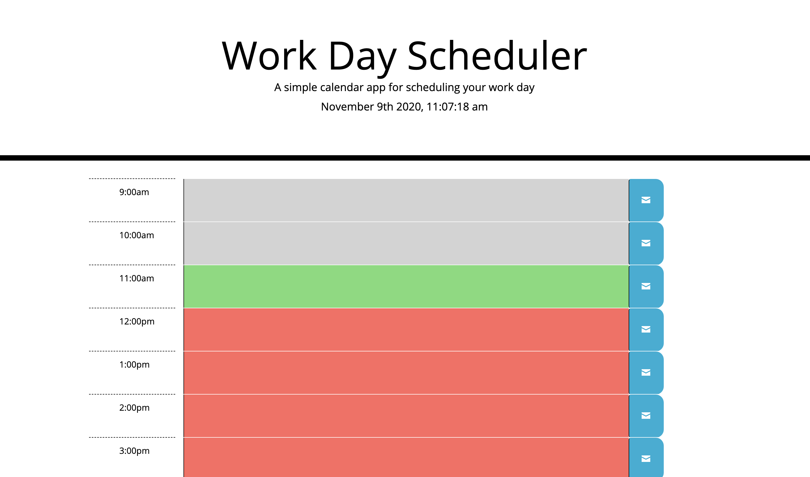
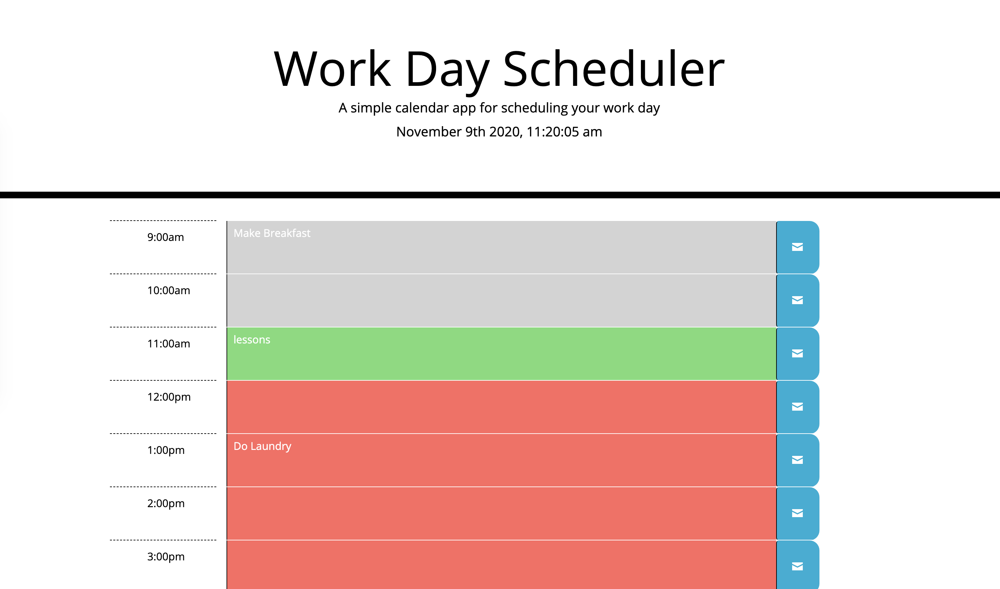

# Work Day Scheduler

## Goal
Object is to create a schedule app for a person's work day. In the app the user will be able to schedule events every hour and save them to the Day Scheduler. The scheduler will then color code the events by letting them know what one is current based on the current time.

- When the planner is opened the current day and time is displayed at the top.
- The planner contains time blocks with standard business hours
- Each time block is color coded to indicate if it is in the past, present, or future
- When the user clicks into the time block they can enter an event
- Once the event is entered the user clickes the "save" button and the event is saved to local storage
- when the page is refreshed the events are still in the time blocks

[Click Here](https://ericasiegel.github.io/daily-calendar/) to see the app.

### Day Scheduler

### Day Scheduler with Events

